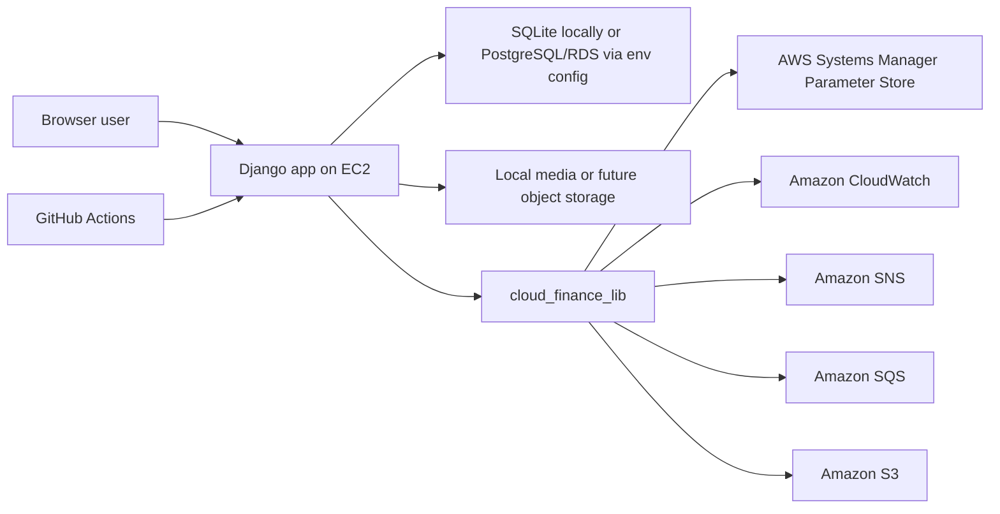

# Architecture Overview

## High-level flow

## Components
- `finance` Django app: request handling, templates, forms, models, and transaction CRUD
- `finance_utils`: calculation helpers for income, expense, and balance
- `cloud_finance_lib`: reusable library that wraps AWS integrations in object-oriented services
- `pfm/settings.py`: environment-driven application and deployment configuration
- `.github/workflows/deploy.yml`: separated CI and CD automation

## Cloud service responsibilities
- Amazon EC2: application hosting target for deployment
- Amazon S3: stores transaction audit payloads generated after saves
- Amazon SNS: publishes high-expense alerts
- Amazon SQS: stores transaction event messages for asynchronous processing evidence
- Amazon CloudWatch: records custom metrics for transaction activity
- AWS Systems Manager Parameter Store: provides runtime configuration such as the alert threshold
- PostgreSQL or RDS-style settings: enabled through environment variables for cloud database migration

## Notes for the report
- Be honest that some integrations are optional and environment-driven
- Include screenshots or logs from the services you actually enable in AWS
- If you stay on SQLite in deployment, say so clearly and discuss RDS as an improvement path rather than claiming you used it
